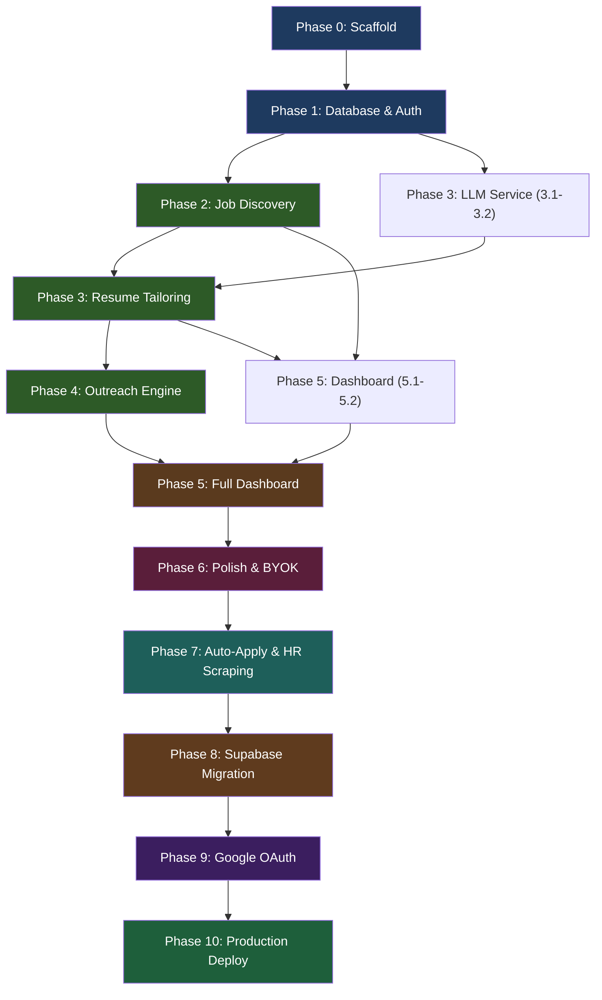

# Implementation Plan: AI-Powered Job Application Platform

> **References**: [problemStatement.md](./problemStatement.md) · [architecture.md](./architecture.md)
> **Version**: 1.0 — June 15, 2026

---

## Execution Strategy

This plan is organized into **7 phases** executed sequentially. Each phase produces a working increment — you can demo the product at the end of every phase. The estimated total timeline is **6–8 weeks** for a solo developer working full-time, or **3–4 weeks** pair-programming with AI assistance.

```
Phase 0 ──▶ Phase 1 ──▶ Phase 2 ──▶ Phase 3 ──▶ Phase 4 ──▶ Phase 5 ──▶ Phase 6
Scaffold     Database     Job          Resume       Outreach     Dashboard    Polish
& Infra      & Auth       Discovery    Tailoring    Engine       & Analytics  & Deploy
─────────────────────────────────────────────────────────────────────────────────────
 2 days       3 days       5 days       5 days       4 days       4 days       3 days
```

> [!IMPORTANT]
> **Phase 0 and Phase 1 are blockers.** Every subsequent phase depends on the scaffold, database, and auth being functional. Phases 2, 3, and 4 are the three core modules — build them in order because each feeds the next. Phase 5 (Dashboard) ties everything together. Phase 6 is polish and deployment.

---

## Phase 0: Project Scaffold & Infrastructure (Days 1–2)

### Goal
Set up the monorepo with Next.js, the Python microservice skeleton, PostgreSQL (Docker), and all tooling configured. By the end, `npm run dev` and `uvicorn` both start without errors.

### Tasks

#### 0.1 Initialize Next.js Project
- Initialize Next.js 15 with App Router, TypeScript, Tailwind CSS, and ESLint in the `final-project/` root
- Configure `tsconfig.json` with strict mode and path aliases (`@/components`, `@/lib`, etc.)
- Install core dependencies:
  ```
  next react react-dom typescript tailwindcss postcss
  @radix-ui/react-slot class-variance-authority clsx lucide-react
  zod react-hook-form @hookform/resolvers
  ```

#### 0.2 Set Up shadcn/ui Design System
- Initialize shadcn/ui with `npx shadcn@latest init`
- Add base components: `button`, `card`, `input`, `label`, `badge`, `dialog`, `dropdown-menu`, `table`, `tabs`, `separator`, `toast`, `avatar`, `textarea`, `select`, `checkbox`
- Configure the global theme in `globals.css` — dark mode, premium color palette, Inter/Geist font family

#### 0.3 Create the Dashboard Shell Layout
- Build `app/(dashboard)/layout.tsx` — responsive sidebar + header + main content area
- Build `components/layout/sidebar.tsx` — nav links for Jobs, Resumes, Outreach, Applications, Settings
- Build `components/layout/header.tsx` — user avatar dropdown, search bar placeholder
- Create placeholder `page.tsx` for each section (Jobs, Resumes, Outreach, Applications, Settings) showing empty states

#### 0.4 Set Up Python Microservice Skeleton
- Create `python-service/` directory with:
  - `app/main.py` — FastAPI app with a `/health` endpoint
  - `app/config.py` — Pydantic settings from environment
  - `requirements.txt` — `fastapi`, `uvicorn`, `sqlalchemy`, `psycopg2-binary`, `playwright`, `python-dotenv`, `httpx`
- Verify `uvicorn app.main:app --reload` starts successfully on `localhost:8000`

#### 0.5 Docker Compose for PostgreSQL
- Create `docker-compose.yml` with PostgreSQL 16 Alpine service
- Add a `.env.example` file with all required environment variables (from architecture doc §10.2)
- Create `.env.local` (gitignored) with local development values
- Verify database is accessible at `localhost:5432`

#### 0.6 Tooling & Quality Gates
- Configure Vitest for unit tests (`vitest.config.ts`)
- Configure Playwright for E2E tests (`playwright.config.ts`)
- Add `.gitignore` covering `node_modules/`, `.env.local`, `.next/`, `__pycache__/`, `*.pyc`, `pgdata/`
- Create initial `README.md` with setup instructions

### Deliverable
- `npm run dev` → Next.js running at `localhost:3000` with a sidebar layout and placeholder pages
- `uvicorn` → Python FastAPI running at `localhost:8000` with `/health` returning `200 OK`
- PostgreSQL running in Docker at `localhost:5432`

### Verification
```bash
# Next.js
npm run dev          # → opens localhost:3000, sidebar renders

# Python
cd python-service
uvicorn app.main:app --reload  # → localhost:8000/health returns {"status": "ok"}

# Database
docker compose up -d postgres
docker compose exec postgres pg_isready  # → accepting connections
```

---

## Phase 1: Database Schema & Authentication (Days 3–5)

### Goal
Full Prisma schema with all 8 entities, migrations applied, NextAuth.js working with register/login/logout, and route protection middleware active.

### Tasks

#### 1.1 Prisma Schema
- Install Prisma: `npm install prisma @prisma/client`
- Create `prisma/schema.prisma` with all entities from architecture §5.1:
  - `User`, `BaseResume`, `ScrapeSession`, `JobListing`, `Application`, `TailoredResume`, `OutreachEmail`, `AuditLog`
- Define all relations, indexes (on `user_id`, `status`, `job_listing_id`), and enums
- Run `npx prisma migrate dev --name init` to generate and apply the migration
- Create `lib/db/prisma.ts` — singleton Prisma client with connection pooling

#### 1.2 Zod Validation Schemas
- Create `lib/validators/` with schemas mirroring the Prisma models:
  - `auth.ts` — `registerSchema`, `loginSchema`
  - `jobs.ts` — `searchQuerySchema`, `bookmarkSchema`
  - `resume.ts` — `uploadResumeSchema`, `tailorRequestSchema`
  - `email.ts` — `generateEmailSchema`, `sendEmailSchema`
  - `application.ts` — `updateStatusSchema`, `updateNotesSchema`
  - `settings.ts` — `smtpSettingsSchema`, `apiKeysSchema`

#### 1.3 Encryption Utility
- Create `lib/encryption.ts` with AES-256-GCM encrypt/decrypt functions
- Uses `ENCRYPTION_SECRET` from environment
- Unit test: encrypt → decrypt roundtrip passes for JSON payloads

#### 1.4 NextAuth.js Integration
- Install: `npm install next-auth@5 bcryptjs`
- Create `lib/auth/auth-options.ts` — Credentials provider with email/password
- Create `app/api/auth/[...nextauth]/route.ts`
- Implement password hashing with bcrypt (12 rounds)
- JWT session strategy stored in httpOnly cookies
- Create `lib/auth/get-session.ts` — helper to get current user in API routes and Server Components

#### 1.5 Auth Pages
- Build `app/(auth)/login/page.tsx` — email + password form, "Don't have an account?" link
- Build `app/(auth)/register/page.tsx` — name + email + password + confirm password form
- Both pages use React Hook Form + Zod validation
- Premium design: centered card, gradient background, subtle animations

#### 1.6 Auth API Routes
- `POST /api/auth/register` — create user, hash password, return session
- NextAuth handles `POST /api/auth/[...nextauth]` for login/logout
- `GET /api/auth/me` — return current user profile (or 401)

#### 1.7 Route Protection Middleware
- Create `middleware.ts` at project root
- Protect all `/dashboard/*` routes — redirect to `/login` if no session
- Protect all `/api/*` routes (except `/api/auth/*`) — return 401 if no session
- Allow `/api/auth/*` and public pages (`/`, `/login`, `/register`) without auth

#### 1.8 Landing Page
- Build `app/page.tsx` — a public landing page with:
  - Hero section explaining the platform value prop
  - Three-column feature highlights (Discover, Tailor, Outreach)
  - CTA buttons → Register / Login
  - Modern design with gradients, glassmorphism, micro-animations

### Deliverable
- Users can register, log in, and log out
- Protected dashboard pages redirect unauthenticated users to login
- API routes return 401 for unauthenticated requests
- Database has all tables created and migrated

### Verification
```bash
npx prisma studio   # → opens database browser, all tables visible
# Register → Login → navigate to /dashboard → works
# Visit /dashboard without login → redirected to /login
# Call GET /api/auth/me with no cookie → 401
```

---

## Phase 2: Job Discovery Engine (Days 6–10)

### Goal
Users can type a natural-language job search query, see real-time scraping progress, browse results in a filterable grid, and bookmark jobs. This phase ports the `job-scrapper` Python CLI into the FastAPI service and connects it to the Next.js UI.

### Tasks

#### 2.1 Python Scraper — Base Architecture
- Create `app/scrapers/base.py` — abstract `BaseScraper` class:
  ```python
  class BaseScraper(ABC):
      async def scrape(self, query: ParsedQuery, limit: int) -> list[RawJobListing]: ...
  ```
- Create `app/normalizers/job_normalizer.py` — normalize raw results to the unified `JobListing` schema (title, company, location, salary_range, description, url, source, tags, posted_at)
- Create `app/db/repository.py` — SQLAlchemy models matching Prisma schema + functions: `create_scrape_session()`, `insert_job_listings()`, `update_session_status()`

#### 2.2 Port RemoteOK Scraper (simplest, no browser needed)
- Create `app/scrapers/remoteok.py` — HTTP-based scraper using `httpx`
- Port logic from `job-scrapper` repo's RemoteOK source
- Normalize results through `job_normalizer`
- Write results to PostgreSQL via `repository.py`

#### 2.3 Port Naukri Scraper (Playwright)
- Create `app/scrapers/naukri.py` — Playwright headless Chrome scraper
- Port logic from `job-scrapper` repo's Naukri source
- Handle pagination (configurable `--pages`)
- Install Playwright browsers in Docker: `RUN playwright install chromium`

#### 2.4 Port Wellfound Scraper (Firecrawl)
- Create `app/scrapers/wellfound.py` — Firecrawl API-based scraper
- Port logic from `job-scrapper` repo's Wellfound source
- Requires `FIRECRAWL_API_KEY` in environment

#### 2.5 NL Query Parser
- Create `app/parsers/query_parser.py` — uses DeepSeek API to parse natural language queries into structured params (`role`, `location`, `experience_level`, `remote`, `keywords`)
- Port prompt and parsing logic from `job-scrapper` repo

#### 2.6 FastAPI Scraping Endpoints
- `POST /scrape/start` — accepts `{session_id, query, sources, limit, pages, headless}`, spawns background task, returns `202 Accepted`
- `GET /scrape/status/{session_id}` — returns current status, job count, progress percentage
- Background task orchestrator: runs selected scrapers in parallel (`asyncio.gather`), writes results to DB, updates session status

#### 2.7 Next.js API Routes for Jobs
- `POST /api/jobs/search` — validates input (Zod), creates `ScrapeSession` in DB, calls Python service `/scrape/start`, returns session ID
- `GET /api/jobs/search/[id]/stream` — SSE endpoint that polls DB every 2s for new `JobListing` rows, streams them to the client
- `GET /api/jobs` — paginated list of all user's scraped jobs, with filters (source, bookmarked, date range, search text)
- `GET /api/jobs/[id]` — single job detail with full description
- `PATCH /api/jobs/[id]/bookmark` — toggle bookmark flag
- `DELETE /api/jobs/[id]` — soft delete a job listing

#### 2.8 Job Discovery UI
- **`components/jobs/job-search-form.tsx`** — natural language input with source checkboxes (Naukri, RemoteOK, Wellfound), limit slider, "Search" button
- **`components/jobs/scrape-progress.tsx`** — animated progress bar + live job count, uses `EventSource` to subscribe to SSE stream
- **`components/jobs/job-card.tsx`** — card showing title, company, location, source badge, salary (if available), bookmark icon, "Tailor Resume" and "Send Email" action buttons
- **`components/jobs/job-list.tsx`** — grid of job cards with:
  - Search/filter bar (text search, source dropdown, bookmarked toggle)
  - Sort by (date, company, relevance)
  - Pagination
- **`app/(dashboard)/jobs/page.tsx`** — combines search form + progress bar + results list
- **`app/(dashboard)/jobs/[id]/page.tsx`** — full job detail view with rendered description, company info, link to original posting, action buttons (Tailor Resume, Draft Email, Bookmark)

### Deliverable
- User types "Product Manager in Bangalore" → scraping starts → progress bar fills → job cards appear in real-time → user can browse, filter, bookmark

### Verification
```bash
# 1. Start a scrape via UI for "Backend Developer" from RemoteOK only
# 2. Watch progress bar animate and job cards appear
# 3. Click bookmark on a job → icon toggles, persists on reload
# 4. Filter by source → only matching jobs shown
# 5. Click a job → detail page with full description
```

---

## Phase 3: Resume Tailoring Engine (Days 11–15)

### Goal
Users can upload a base resume, select a scraped job, and get an AI-tailored resume with an ATS score, visual diff, and PDF download. This phase ports the `resume-shapeshifter` logic into the unified platform.

### Tasks

#### 3.1 LLM Service Abstraction
- Create `lib/services/llm-service.ts` — unified interface for Groq and DeepSeek:
  - `complete(config, request)` — single completion
  - `streamComplete(config, request)` — streaming completion (for real-time UI)
- Both providers use the OpenAI-compatible API format (`/chat/completions`)
- Automatic fallback: if Groq fails, retry with DeepSeek
- Token usage tracking in response

#### 3.2 LLM Prompt Templates
- Create `lib/prompts/resume-tailor.system.md` — system prompt for resume tailoring (expert resume writer persona, ATS optimization rules, output format specification)
- Create `lib/prompts/resume-tailor.user.md` — user prompt template with `{{base_resume}}` and `{{job_description}}` placeholders
- Create `lib/prompts/ats-score.system.md` — system prompt for scoring resume-JD match (returns 0–100 score with justification)
- Create `lib/prompts/loader.ts` — utility to load and interpolate prompt templates

#### 3.3 Resume Service
- Create `lib/services/resume-service.ts`:
  - `tailorResume(baseResumeText, jobDescription, model?)` — calls LLM, returns `{tailored_text, changes_summary, ats_score}`
  - `generatePdf(htmlContent)` — renders tailored resume HTML to PDF using `@sparticuz/chromium`
  - `extractTextFromPdf(buffer)` — extract text from uploaded PDF (for base resume ingestion)

#### 3.4 Resume API Routes
- `POST /api/resume/upload` — multipart file upload (PDF) or text paste. Extracts text, stores in `BaseResume` table, saves file to `public/uploads/` (or Vercel Blob)
- `GET /api/resume/base` — list user's base resumes
- `DELETE /api/resume/base/[id]` — delete a base resume
- `POST /api/resume/tailor` — accepts `{job_listing_id, base_resume_id}`:
  1. Fetch job description and base resume text from DB
  2. Call `resumeService.tailorResume()`
  3. Create `Application` record (status: `resume_tailored`) if not exists
  4. Create `TailoredResume` record with results
  5. Return tailored text, changes summary, ATS score
- `GET /api/resume/tailored/[id]` — get a tailored resume with its linked job and base resume
- `PUT /api/resume/tailored/[id]` — update tailored text (user edits)
- `POST /api/resume/tailored/[id]/pdf` — generate PDF from tailored resume, store path
- `GET /api/resume/tailored/[id]/pdf` — download the generated PDF

#### 3.5 Resume Upload UI
- **`components/resume/resume-upload.tsx`** — drag-and-drop zone + text paste tab:
  - Accepts `.pdf` files (max 5MB)
  - Shows upload progress
  - After upload, shows extracted text preview
  - "Set as Default" toggle
- **`app/(dashboard)/resumes/page.tsx`** — list of uploaded base resumes + upload form

#### 3.6 Resume Tailoring UI
- **`components/resume/resume-editor.tsx`** — side-by-side view:
  - Left panel: original base resume (read-only, scrollable)
  - Right panel: AI-tailored version (editable rich text)
  - Highlighted changes (added keywords, reworded bullets)
- **`components/resume/ats-score-badge.tsx`** — circular progress badge showing ATS match score (0–100) with color coding (red < 50, yellow 50–75, green > 75)
- **`components/resume/changes-diff.tsx`** — summary card listing:
  - Keywords added/matched
  - Bullets reworded
  - Sections reordered
  - Skills prioritized
- **`components/resume/resume-preview.tsx`** — PDF preview embed + "Download PDF" button
- **Entry point from Jobs page**: clicking "Tailor Resume" on a job card → navigates to tailoring workspace with job description pre-loaded
- **`app/(dashboard)/resumes/tailored/[id]/page.tsx`** — full tailoring workspace

#### 3.7 Integration: Jobs → Resume Flow
- On `jobs/[id]/page.tsx`, the "Tailor Resume" button:
  1. If user has no base resume → prompt to upload one first
  2. If user has base resumes → show a picker (or use default)
  3. Call `POST /api/resume/tailor` with job ID and selected resume
  4. Show loading animation ("AI is tailoring your resume...")
  5. Redirect to `resumes/tailored/[id]` with results

### Deliverable
- User uploads a resume → selects a job → clicks "Tailor Resume" → AI generates optimized version → user sees side-by-side diff + ATS score → downloads PDF

### Verification
```bash
# 1. Upload a base resume (PDF or paste text)
# 2. Go to Jobs → select a job → "Tailor Resume"
# 3. Wait for AI processing → side-by-side editor loads
# 4. Check ATS score badge
# 5. Edit tailored text → save
# 6. Click "Download PDF" → valid PDF downloads
# 7. Reload page → tailored resume persists
```

---

## Phase 4: Outreach Engine (Days 16–19)

### Goal
Users can generate AI-powered cold emails referencing the job listing and tailored resume, preview/edit them, and send via Gmail SMTP — with dry-run mode, volume caps, and an audit trail. This phase ports the `cold-email-sender` safety-first approach into the web UI.

### Tasks

#### 4.1 Email Generation Prompts
- Create `lib/prompts/email-generate.system.md` — system prompt for cold email writing (professional, concise, personalized, non-spammy)
- Create `lib/prompts/email-generate.user.md` — template with:
  - `{{job_title}}`, `{{company_name}}`, `{{job_description_summary}}`
  - `{{candidate_name}}`, `{{resume_highlights}}` (top 3 matching skills/experiences from tailored resume)
  - `{{recipient_name}}`, `{{recipient_role}}`

#### 4.2 Email Service
- Create `lib/services/email-service.ts`:
  - `generateEmail(applicationId, recipientInfo)` — calls LLM to generate subject + body
  - `sendEmail(emailId)` — runs safety pipeline, sends via Nodemailer:
    1. Check auth
    2. Check dry_run flag
    3. Check SMTP credentials exist
    4. Check daily volume cap (`MAX_EMAILS_PER_DAY`)
    5. Check duplicate recipient
    6. Send via SMTP
    7. Log to `AuditLog`
  - `skipEmail(emailId)` — mark as skipped, log
- Install Nodemailer: `npm install nodemailer @types/nodemailer`
- Configure SMTP transporter with user's encrypted credentials (decrypted at runtime)

#### 4.3 Email API Routes
- `POST /api/email/generate` — accepts `{application_id, recipient_email, recipient_name}`, calls email service, creates `OutreachEmail` with status `drafted`
- `GET /api/email/[id]` — get email draft details
- `PUT /api/email/[id]` — edit subject/body before sending
- `POST /api/email/[id]/send` — execute safety pipeline + send
- `POST /api/email/[id]/skip` — skip this email
- `GET /api/email/audit-log` — paginated audit log (all sent/skipped/failed emails)

#### 4.4 Settings: SMTP Configuration
- **`app/(dashboard)/settings/page.tsx`** — settings form with tabs:
  - **SMTP tab**: email, app password, SMTP host, port + "Test Connection" button
  - **API Keys tab**: Groq key, DeepSeek key
  - **Outreach tab**: dry-run toggle, max emails per day, default sender name
- `PUT /api/settings/smtp` — encrypt and store SMTP credentials
- `PUT /api/settings/api-keys` — encrypt and store API keys
- `GET /api/settings` — return settings (SMTP: masked password, keys: masked)

#### 4.5 Email Outreach UI
- **`components/outreach/email-composer.tsx`** — email editor with:
  - To, Subject, Body fields
  - Rich text toolbar (bold, italic, links)
  - "Regenerate with AI" button to get a new draft
  - Character/word count
- **`components/outreach/email-preview.tsx`** — rendered preview of the email as the recipient would see it (HTML rendered in an iframe sandbox)
- **`components/outreach/send-controls.tsx`** — action bar:
  - Dry-run indicator (yellow banner if active)
  - "Send" button (green, with confirmation dialog)
  - "Skip" button (gray)
  - "Save Draft" button
  - Volume cap indicator ("3 of 10 emails sent today")
- **`components/outreach/audit-log-table.tsx`** — data table with columns: date, recipient, subject, status (sent/skipped/failed/dry-run), actions (view)
- **`app/(dashboard)/outreach/page.tsx`** — list of drafts + audit log tabs
- **`app/(dashboard)/outreach/[id]/page.tsx`** — single email composer + preview

#### 4.6 Integration: Jobs/Resume → Outreach Flow
- On `jobs/[id]` and `resumes/tailored/[id]` pages, add a "Draft Outreach Email" button
- This button:
  1. Opens a dialog to enter recipient email + name
  2. Calls `POST /api/email/generate` with the application ID
  3. Navigates to `outreach/[email_id]` to preview and edit the generated email
- The email body references the job title, company, and top matched skills from the tailored resume

### Deliverable
- User clicks "Draft Email" on a job/resume → AI generates personalized email → user previews, edits → clicks Send → email delivered via Gmail (or dry-run logged)

### Verification
```bash
# 1. Configure SMTP in Settings (use a test Gmail + App Password)
# 2. Keep dry-run ON → generate an email for a job → "Send" → see dry-run message
# 3. Turn dry-run OFF → send to your own email → check Gmail inbox
# 4. Check audit log → entry appears with status "sent"
# 5. Try exceeding volume cap → get blocked with cap message
# 6. Skip an email → audit log shows "skipped"
```

---

## Phase 5: Application Dashboard & Analytics (Days 20–23)

### Goal
A Kanban board tracking every application through its lifecycle (Discovered → Offer/Rejected), per-application timeline views, and aggregate analytics. This phase builds the new "glue" layer that makes the platform feel unified.

### Tasks

#### 5.1 Application Service
- Create `lib/services/application-service.ts`:
  - `getApplications(userId, filters)` — list applications with status, job info, resume info, email info (JOIN query)
  - `getApplicationById(id)` — full detail with timeline events from `AuditLog`
  - `updateStatus(id, newStatus)` — validate transition, update, log
  - `updateNotes(id, notes)` — save user notes
  - `getStats(userId)` — aggregate counts by status, source, date, response rate

#### 5.2 Application API Routes
- `GET /api/applications` — list with filters: status, source, date range, search text. Returns applications with nested job + latest resume + latest email data
- `GET /api/applications/[id]` — single application with full timeline (all audit log entries for this application's job, resume, and email entities)
- `PATCH /api/applications/[id]/status` — update status (e.g., move from "Email Sent" to "Response Received")
- `PATCH /api/applications/[id]/notes` — update notes
- `GET /api/applications/stats` — dashboard statistics:
  ```json
  {
    "total": 47,
    "by_status": {"discovered": 20, "resume_tailored": 12, "email_sent": 8, ...},
    "by_source": {"naukri": 25, "remoteok": 15, "wellfound": 7},
    "this_week": 12,
    "response_rate": 0.25
  }
  ```

#### 5.3 Kanban Board UI
- **`components/dashboard/kanban-board.tsx`** — horizontal scrollable board with 6 columns:
  - Discovered, Resume Tailored, Email Sent, Response Received, Interview, Offer
  - Each column shows a count badge
  - Cards are draggable between columns (updates status via API)
- **`components/dashboard/kanban-column.tsx`** — single column with:
  - Column header (title + count)
  - Drop zone styling
  - Scrollable card list
- **`components/dashboard/kanban-card.tsx`** — compact card showing:
  - Job title + company
  - Source badge (Naukri/RemoteOK/Wellfound)
  - Days since last action
  - Quick action icons (view, edit notes)
- Use `@hello-pangea/dnd` or native HTML drag-and-drop for drag-drop functionality
- **`app/(dashboard)/applications/page.tsx`** — Kanban board page

#### 5.4 Application Timeline View
- **`components/dashboard/timeline.tsx`** — vertical timeline showing all events:
  - 🔍 Job discovered (date, source, link)
  - 📝 Resume tailored (date, ATS score, link to tailored resume)
  - 📧 Email drafted / sent / skipped (date, recipient, subject)
  - 💬 Response received (user-added)
  - 🎤 Interview scheduled (user-added)
  - 🎉 Offer received (user-added)
  - Each event is a card with timestamp, description, and action links
- **`app/(dashboard)/applications/[id]/page.tsx`** — application detail with:
  - Header: job title, company, status badge
  - Timeline view
  - Notes section (editable text area)
  - Quick actions: "Tailor Resume", "Draft Email", "Update Status"

#### 5.5 Dashboard Home / Overview
- **`components/dashboard/stats-cards.tsx`** — 4 stat cards at the top:
  - Total Applications | This Week | Emails Sent | Response Rate
  - Each with an icon, value, and trend arrow
- **`components/dashboard/analytics-charts.tsx`** — two charts:
  - Bar chart: applications by status (pipeline funnel)
  - Pie chart: applications by source
  - Use a lightweight chart library (`recharts` or inline SVGs)
- **Recent Activity feed** — last 10 actions from audit log
- **`app/(dashboard)/page.tsx`** — dashboard home combining stats + charts + recent activity

#### 5.6 Automatic Application Creation
- Ensure `Application` records are auto-created at the right moments:
  - When a user bookmarks a job → create Application (status: `discovered`)
  - When a user tailors a resume → upsert Application (status: `resume_tailored`)
  - When a user sends an email → update Application (status: `email_sent`)
- This logic lives in the service layer and is triggered by the respective API routes

### Deliverable
- Dashboard home with stats + charts + activity feed
- Kanban board with drag-and-drop status updates
- Per-application timeline showing the full journey from discovery to offer

### Verification
```bash
# 1. Dashboard home → stats cards show correct counts
# 2. Kanban board → cards appear in correct columns
# 3. Drag a card from "Email Sent" to "Response Received" → status updates
# 4. Click a card → application detail with timeline
# 5. Add notes → save → persist on reload
# 6. Charts reflect current data accurately
```

---

## Phase 6: Polish, Testing & Deployment (Days 24–26)

### Goal
Production-ready deployment with polished UX, comprehensive error handling, loading states, responsive design, and automated tests.

### Tasks

#### 6.1 UX Polish
- **Loading states**: skeleton loaders for job cards, resume content, email preview
- **Empty states**: illustrated empty states for each page (no jobs yet, no resumes, etc.)
- **Toast notifications**: success/error toasts for all mutations (save, send, delete)
- **Confirmation dialogs**: before destructive actions (delete resume, send email, skip email)
- **Error boundaries**: catch and display friendly error messages instead of white screens
- **Responsive design**: test and fix layouts on mobile (375px), tablet (768px), desktop (1280px+)
- **Keyboard shortcuts**: `Ctrl+K` for search, `Escape` to close modals
- **Micro-animations**: button hover effects, page transitions, card entrance animations

#### 6.2 Landing Page Enhancement
- Polish the public landing page with:
  - Animated hero illustration or gradient mesh
  - Feature showcase with icons and short descriptions
  - "How it works" 3-step visual flow
  - Testimonials section (placeholder)
  - Footer with links

#### 6.3 Error Handling & Edge Cases
- Handle Python service unreachable (show "Scraping service offline" banner)
- Handle LLM API failures (show error, offer retry)
- Handle SMTP send failures (mark email as `failed`, show error message)
- Handle expired sessions gracefully (redirect to login with toast)
- Rate limit API routes (prevent abuse)
- Input sanitization on all user-facing text fields

#### 6.4 Testing
- **Unit tests** (Vitest):
  - `lib/encryption.ts` — encrypt/decrypt roundtrip
  - `lib/services/llm-service.ts` — mock API, verify prompt construction
  - `lib/services/email-service.ts` — safety pipeline logic (volume cap, dry-run, duplicate check)
  - `lib/validators/*.ts` — schema validation edge cases
  - Zod schema tests for all API inputs
- **Integration tests**:
  - API route tests with mocked DB (Prisma mock)
  - Auth flow: register → login → access protected route → logout
- **E2E tests** (Playwright):
  - Full flow: login → search jobs → tailor resume → draft email → (dry-run) send
  - Dashboard: verify Kanban cards, drag-and-drop
- **Python service tests**:
  - Unit tests for normalizers, parsers
  - Integration test for RemoteOK scraper (uses real API)

#### 6.5 Deployment
- **Vercel deployment**:
  - Connect GitHub repo to Vercel
  - Set all environment variables in Vercel dashboard
  - Configure `next.config.ts` for production (image optimization, headers)
- **Python service deployment** (Railway or Fly.io):
  - Create `Dockerfile` for Python service with Playwright + Chromium
  - Deploy to Railway
  - Set environment variables (DATABASE_URL, API keys)
  - Expose public URL → set as `PYTHON_SERVICE_URL` in Vercel env
- **Database** (Neon or Supabase):
  - Create production PostgreSQL instance
  - Run `npx prisma migrate deploy`
  - Set `DATABASE_URL` in both Vercel and Railway
- **DNS / Domain** (optional):
  - Point custom domain to Vercel
  - Update `NEXTAUTH_URL` to production domain

#### 6.6 Documentation
- Update `README.md` with:
  - Project overview and screenshots
  - Local development setup (step-by-step)
  - Environment variables reference
  - Deployment guide
  - API documentation summary
- Create `CONTRIBUTING.md` with coding conventions

### Deliverable
- Production deployment accessible via public URL
- All critical paths tested (auth, search, tailor, send)
- Polished, responsive UI that feels premium

### Verification
```bash
# Local
npm run test          # → Vitest unit tests pass
npm run test:e2e      # → Playwright E2E tests pass
cd python-service && python -m pytest  # → Python tests pass

# Production
# Visit production URL → landing page loads
# Register → Login → full flow works
# Test on mobile → responsive layouts
# Test with slow network → loading states appear
```

---

### Phase 7: Auto-Apply & HR Email Scraping ✅ COMPLETE
**Goal:** Automate the end-to-end outreach process by automatically finding HR contacts for a specific company and dispatching the tailored application.

#### 7.1 HR Email Scraper (Python Service)
- Built `python-service/app/scrapers/hr_scraper.py` using `duckduckgo-search` library
- Uses advanced search dorking (e.g. `"{Company}" "HR" OR "Recruiter" email site:linkedin.com`) to find recruiter emails
- Filters out generic `info@` addresses, prioritizes company domain matches, fallback to `careers@domain`
- Exposed via `POST /api/scrape/hr-contacts` in `scrape_routes.py`

#### 7.2 Auto-Apply Pipeline (Next.js)
- Extended `Application` model with `isAutoApplied` boolean field
- Implemented `lib/services/auto-apply-service.ts`:
  1. Grabs user's default Base Resume
  2. AI-tailors it for the job listing
  3. Calls Python service to fetch HR email for `job.company`
  4. Generates cold email draft
  5. Auto-dispatches if `dryRunEnabled` is false
- Exposed via `POST /api/applications/auto-apply` route
- Added **"Auto Apply ⚡"** button directly on every Job Card in the UI

---

### Phase 8: Supabase Migration (Auth + Database) ✅ COMPLETED
**Goal:** Replace NextAuth.js + Neon Postgres with Supabase, enabling one-click Google OAuth and a unified platform for auth and database management.

#### Why Supabase?
| Benefit | Detail |
|---|---|
| **Unified platform** | Auth + DB + Dashboard in one place |
| **Google OAuth** | One toggle in dashboard (no Google Cloud Console) |
| **Supabase Studio** | Richer than Neon, with real-time table editor |
| **Row Level Security** | Database-level access control |
| **Free tier** | 500 MB DB + 50k monthly active users |

#### 8.1 Supabase Project Setup
- Create project on supabase.com, copy `SUPABASE_URL`, `SUPABASE_ANON_KEY`, `DATABASE_URL`, `DIRECT_URL`
- Enable Google provider in Supabase Dashboard → Auth → Providers

#### 8.2 Package Changes
```bash
npm install @supabase/supabase-js @supabase/ssr
npm uninstall next-auth @next-auth/prisma-adapter
```

#### 8.3 Schema & Client Setup
- Remove NextAuth `Account`/`Session`/`VerificationToken` models from `schema.prisma` (Supabase handles natively)
- Add `directUrl` to Prisma datasource for Supabase pooler compatibility
- Create `lib/supabase/client.ts` (browser) and `lib/supabase/server.ts` (SSR, reads cookies)
- Update `middleware.ts` to use Supabase SSR session refresh pattern

#### 8.4 Migrate Auth Layer (~25 API Routes)
All routes using `getSession()` from `lib/auth/get-session.ts` will be updated to:
```ts
const supabase = createClient(cookies());
const { data: { user } } = await supabase.auth.getUser();
```

Affected routes:
- `app/api/applications/` — 5 routes
- `app/api/email/` — 5 routes
- `app/api/jobs/` — 6 routes
- `app/api/resume/` — 5 routes
- `app/api/settings/` — 2 routes
- `app/api/auth/me/` — 1 route
- `app/api/applications/auto-apply/` — 1 route

#### 8.5 Migrate Auth Pages
- **Login:** `signIn("credentials")` → `supabase.auth.signInWithPassword()` | `signIn("google")` → `supabase.auth.signInWithOAuth({ provider: 'google' })`
- **Register:** `POST /api/auth/register` → `supabase.auth.signUp()`
- **Logout:** NextAuth `signOut()` → `supabase.auth.signOut()`

---

### Phase 9: Google OAuth via Supabase ✅ COMPLETED
**Goal:** Enable one-click Google sign-in using Supabase's built-in OAuth provider.

- Enable Google in Supabase Dashboard → Auth → Providers
- Add Supabase callback URL to Google Cloud Console (only the redirect, not full OAuth app setup)
- Test Google sign-in on both `/login` and `/register` pages

---

### Phase 10: Production Deployment 🚧 IN PROGRESS
**Goal:** Deploy the full platform to production.

#### 10.1 Platforms
| Service | Platform | Notes |
|---|---|---|
| Database + Auth | Supabase | Already configured in Phase 8 |
| Next.js App | Vercel | Connect GitHub repo, auto-deploys |
| Python Scraper | Render.com | Docker container, `python-service/` root |

#### 10.2 Vercel Environment Variables
```env
NEXT_PUBLIC_SUPABASE_URL=
NEXT_PUBLIC_SUPABASE_ANON_KEY=
DATABASE_URL=          # Supabase pooler URL
DIRECT_URL=            # Supabase direct URL
PYTHON_SERVICE_URL=    # Render.com URL
OPENAI_API_KEY=
ENCRYPTION_SECRET=
```

---

## Full Feature Inventory

| Phase | Feature | Status |
|---|---|---|
| 0 | Project scaffold, Next.js 16, Python FastAPI | ✅ Complete |
| 1 | Prisma schema, NextAuth, login/register | ✅ Complete |
| 2 | Job scrapers (Naukri, RemoteOK, Wellfound), real-time streaming | ✅ Complete |
| 3 | Resume upload, AI tailoring (OpenAI/Groq), ATS scoring | ✅ Complete |
| 4 | Cold email generation, SMTP dispatch, outreach audit log | ✅ Complete |
| 5 | Dashboard analytics, kanban application tracker | ✅ Complete |
| 6 | Pro/Free tier (BYOK monetization), locked settings UI | ✅ Complete |
| 7 | Auto-Apply pipeline, HR email scraping via DuckDuckGo | ✅ Complete |
| 8 | Supabase migration (replaces NextAuth + Neon) | 🚧 In Progress |
| 9 | Google OAuth via Supabase one-click toggle | ⏳ Pending |
| 10 | Production deployment (Vercel + Render) | ⏳ Pending |

---

## Dependency Graph



---

## Risk Register

| Risk | Impact | Likelihood | Mitigation |
|------|--------|-----------|------------|
| **Naukri blocks scraping** | Job source unavailable | Medium | Retry with backoff, user-agent rotation; fallback to RemoteOK + Wellfound |
| **OpenAI API rate limits** | Resume tailoring fails | Low | Groq fallback already built in; queue requests |
| **Gmail SMTP blocks bulk sends** | Emails not delivered | Medium | Enforce strict volume caps (10/day default); guide users to use App Passwords |
| **Vercel serverless timeout** | LLM calls fail | Medium | Use streaming responses; optimize PDF templates |
| **Playwright in Docker too large** | Slow Python service deploys | Low | Use slim Chromium images; cache browser install in Docker layer |
| **User uploads malicious PDF** | Security breach | Low | Validate MIME type, size limits, sandboxed processing |
| **HR Email Search Rate Limits** | Scraper fails | High | Use rotating proxies or Hunter.io API fallback |
| **Supabase free tier limits** | Outage at scale | Low | Monitor usage; upgrade to Pro ($25/mo) before hitting limits |
| **Supabase cookie/session mismatch** | Auth bugs on upgrade | Medium | Clear all sessions post-migration; follow official SSR patterns exactly |

---

## File Delivery Checklist

| Phase | Key Files |
|-------|----------|
| **0** | `package.json`, `next.config.ts`, `docker-compose.yml`, `python-service/app/main.py`, `components/layout/*` |
| **1** | `prisma/schema.prisma`, `lib/auth/*`, `lib/encryption.ts`, `lib/validators/*`, `app/(auth)/*` |
| **2** | `python-service/app/scrapers/*`, `app/api/jobs/*`, `components/jobs/*` |
| **3** | `lib/services/llm-service.ts`, `lib/services/resume-service.ts`, `lib/prompts/*`, `app/api/resume/*` |
| **4** | `lib/services/email-service.ts`, `app/api/email/*`, `app/api/settings/*`, `components/outreach/*` |
| **5** | `app/api/applications/*`, `components/dashboard/*`, `app/(dashboard)/*` |
| **6** | `app/(dashboard)/settings/page.tsx` (BYOK UI), `lib/services/llm-service.ts` (tier logic) |
| **7** | `python-service/app/scrapers/hr_scraper.py`, `lib/services/auto-apply-service.ts`, `app/api/applications/auto-apply/` |
| **8** | `lib/supabase/client.ts`, `lib/supabase/server.ts`, `middleware.ts`, updated auth pages, updated all 25 API routes |
| **9** | Supabase dashboard config (no code change), `.env` update |
| **10** | Vercel deployment, Render Docker config, production env vars |

---

*Implementation plan v2.0 — June 2026 (Supabase Migration)*  
*Companion documents: [problemStatement.md](./problemStatement.md) · [architecture.md](./architecture.md)*
